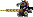
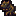
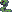

# PyDungeon

Проект для Я.Лицея по библиотеке pygame.

Проект представляет собой 2D игру, написанную на языке Python с использованием 
библиотеки Pygame. Жанр игры - метроидвания (хотя по факту платформер). 
Действие игры происходит в подземелье. Цель игры - дойти до конца каждого 
уровня. Игрок управляет воином, способным выполнять несколько типов атак. 
По уровню расставлены различные враги, при столкновении с которыми игрок 
получает урон. Враги появляются при загрузке уровня, заново не возраждаются. 
Игрок может обойти врагов, либо же убить их. На данный момент в игре 
присутствуют 3 уровня, 2 типа атак и 4 типа врагов. Также присутствует редактор 
уровней.


## Информация о работе (ТЗ)

### Игра

При запуске файла \_\_main\_\_.py появляется главное (да и впрочем, 
единственное) окно игры. Игрок сразу появляется на уровне, начинает играть 
саундтрек.

#### Уровни

Каждый уровень состоит множества из тайлов (блоков). Все текстуры тайлов 
расположены в файле data/sprites.png. Конфигурация тайлов описывается в файле 
[data/tile_config.json](#--tile_configjson). На конце каждого уровня стоит 
выход, при входе в который игрок переходит на другой уровень, либо, если далее 
уровней нет, игра завершается с сообщением о победе. При понижении уровня 
здоровья до 0 герой падает на землю, вскоре после чего игра завершается с 
соответствующим сообщением. При появлении сообщения вы можете нажать Esc для 
выхода из игры. Конфигурация уровней задаётся в файле 
[data/levels.json](#о-файле-level.json).

#### Герой

Управление героем описано в [соответствующем разделе](#в-игре).

Герой имеет две характеристики: здоровье и выносливость. Выносливость 
тратиться при проведении атак, здоровье убавляется при соприкосновении с 
врагами. Обе характеристики со временем восстанавливаются.  
Игрок имеет два типа атак: ближняя и дальняя.  
При проведении ближней атаки герой замахивается, после чего появляется спрайт 
атаки, который, при соприкосновении с врагом, наносит ему урон.  
При проведении дальней атаки герой также замахивается, после чего кидает клинок.
Клинок, при соприкосновении с врагом наносит ему урон, при соприкосновении с 
тайлом ломается.  

#### Интерфейс игры

В верхнем левом углу отображается две полосы: полоса здоровья зелёного цвета и 
полоса выносливости голубого цвета. При изменении здоровья или выносливости 
изменяется соответствующая полоса.

При нажатии на кнопку Esc игра останавливается, и открывается меню. В меню 
расположено три пункта: Resume, Settings и Exit.

При нажанитии на Resume меню закрывается и игра продолжается.

При нажатии на Settings появляется окно с настройками, в котором можно включить 
или выключить полноэкранный режим.

При нажатии на Exit происходит выход из игры.

При повторном нажатии кнопки Esc меню закрывается и игра продолжается.

#### Враги

Игроки расставляются по уровню во время загрузки. На данный момент ни один враг 
не возрождается после своей смерти.

Есть два типа врагов:

1. Ближнебойные враги  
Данный тип врагов перемещается по земле, подчиняется гравитации (падает, если 
под ногами отсутствуют тайлы). При столкновении с врагом игрок 
оглушается(временно теряет управление над героем), получает урон и откидывается 
в сторону.
2. Ближнебойные враги с ограничением движения по оси абцисс  
Этот тип врагов почти полностью повторяет 1-ый тип врагов, за исключением того, 
что враги данного типа могут отойти от места появления максимум на 
фиксированное кол-во тайлов.

Реализовано 4 вида врагов 2-го вида: 
* Insect 
* Knight 
* Rat 
* Snake 

Различаются они только своими спрайтами, уроном, наносимым игроку при 
столкновении и количеством очков здоровья. При понижении здоровья врагов до 0
они погибают, проигрывается соответствующая анимация, вскоре после чего труп 
врага пропадает.

### Редактор уровней

В проекте также присутствует собственный редактор уровней - LevelEditor.py. 
Уровни хранятся в виде csv таблиц. Редактор представляет из себя подобие 
консоли. Команды редактора описаны в 
[соответствующем разделе](#----leveleditorpy). При запуске команд, связанных с 
редактированием карты, открывается окно с редактированием уровней. В верхнем 
правом углу редактора отображается счётчик FPS. Управление редактора описано в 
том же [разделе](#----leveleditorpy), что и команды редактора. Для выхода из 
окна редактирования уровней необходимо это самое окно закрыть. В этом случае 
вы снова сможете вводить команды редактора.

## Сборка

Для запуска программы установите [Python](
https://www.python.org/downloads/) версии 3.7 и выше.

Затем зайдите в командную строку (bash, cmd, PowerShell). Если ваш ПК работает 
под управлением ОС Windows, то для запуска командной строки вам необходимо 
нажать сочетание клавиш Win+R и в появившемся окошке ввести "cmd".

Введите в открывшейся командной строке команду для перехода в директорию 
приложения (в директорию, в которой находится этот файл README.md). В cmd для 
этого необходимо набрать команду `cd /D "путь/к/приложению"`, где 
"путь/к/приложению" - это полный путь к директории приложения.

Затем в командной строке введите последовательно команды `python -m venv venv` 
и `venv\Scripts\activate` (для cmd) или `venv/bin/activate` (для bash). 
Выполнив эти команды, вы создадите виртуальное окружение (чтобы выйти из 
виртуального окружения после того, как закончите работать с приложением, 
выполните команду `venv\Scripts\deactivate` в cmd или `venv/bin/deactivate` в 
bash)

После этого установите все зависимости, выполните в консоли команду 
`pip install -r requirements.txt`. Вы можете пропустить прошлый пункт и не 
создавать виртуальное окружение, хоть это и не рекомендуется.

В конце концов, для запуска игры выполните команду `python . -m`. Для запуска 
редактора уровней воспользуйтесь командой `python LevelEditor.py`.

Для запуска программы в будущем опять зайдите в консоль, перейдите в директорию 
приложения, запустите виртуальную среду (если вы её создавали) и выполните 
команду `python . -m` для запуска игры или `python LevelEditor.py` для запуска 
редактора уровней. 

## О файле level.json

Данный файл содержит конфигурацию уровней.  
Данные записываются в формате:  
```
{
  "firstLevel": "*уровень*",
  "*уровень1*":
  {
    "mapFile": "*путь к карте*",
    "nextStage": "*следующий уровень*",
    "music": "*путь к музыке*",
    "heroPos": [*x*, *y*],
    "enemies": [['*тип врага*', *параметры*], ...]
  },
  "*уровень2*": {...},
  ...
}
```
где  
- *уровень* - название уровня, который загрузится первым
- *уровень1* - название уровня, для которого задаётся конфигурация 
(запрещено давать уровню название firstLevel)
- *x* - координата x игрока
- *y* - координата y игрока
- *тип врага* - класс врага
- *параметры* - список параметров, которые передадутся в конструктор класса 
врага. Записываются также, как если бы вы их передали напрямую в Python

Параметры enemies, music, nextLevel можно опустить.

## О файле tile_config.json

Данный файл содержит информацию о тайлах.  
Данные записываются в формате:  
```
"*номер*": {"isSolid": true/false,
            "isPlatform": true/false,
            "leverState": -1/0/1,
            "damage": *число*,
            "animation": [*задержка1*, *спрайт2*, *задержка2*...]}
```
ИЛИ
```
"*начало*:*конец*": {"isSolid": true/false,
                     "isPlatform": true/false,
                     "leverState": -1/0/1,
                     "damage": *число*,
                     "animation": [*задержка1*, *спрайт2*, *задержка2*...]}
```         
Во втором случае всем тайлам, в промежутке от *начало* до *конец*,
присваиваются одинаковые характеристики.  
Некоторые характеристики можно не указывать, тогда им будет выставлено
стандартное значение - false (или 0 для damage и -1 для leverState).  
Тайлы, не объявленные в этом файле,
будут иметь стандартное значение для всех характеристик.

## Управление и команды

### Редактор уровней - LevelEditor.py

Редактор уровней представляет собой подобие консоли. При исполнении 
определённых команд открывается окно редактора, непосредствено в котором можно 
создавать уровни.

В консоли:

Команды (в скобках сокращённый вариант):
- open(o) path - открыть карту по пути path  
- new(n) path - создать новую карту по пути path  
- openas(s) path1 path2 - загрузить карту по пути path1
и сохранить её по пути path2  
- resolution(r) w h - изменить разрешение окна редактора на w x h  
- resolution(r) - вывести текущее разрешение  
- quit(q) - закрыть программу  
Если в каком-то аргументе присутствуют пробелы, 
то вписывайте его в двойных кавычках

Управление в редакторе:

- W, A, S, D - перемещение камеры
- Shift (удерживание) - ускорить перемещение
- Ctrl + S - сохранить карту
- E - открыть/закрыть список тайлов
- ЛКМ - поставить выбранную плитку
- Средняя кнопка мыши (клик по колёсику) - конфигурация плитки, производится в 
консоли
- ПКМ - удалить плитку
- V - вывести координаты плитки

### В игре

Управление:
- Стрелочки - перемещение, прыжок на стрелку вверх
- Z - ближняя атака
- X - дальняя атака
- Esc - открыть меню


## Источники

* [Спрайты](https://opengameart.org/content/castle-platformer-assets)
